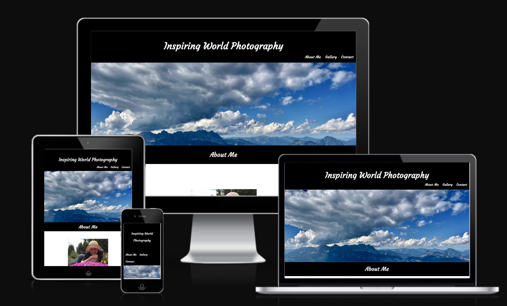

# Inspiring World Photography

The Inspiring World Photography website is a nature photography portfolio of Rachel Hankai. Users on the page can enjoy the various photographs, get inpiration for their own phtography and make inquiries as to any further information they may want.

Users will be able to contact the photographer with any requests or further questions regarding any of the photographs. They can also find out a little bit about the photographer's background and creativity. This site could be used by any other photographer looking for inpiration, interest in any of the prints or others just wanting to enjoy the photographs.

[View the live project here.](https://rachank.github.io/inspiring-world-photography2/)

## Features

### Navigation

* Positioned at the top of the page, with the main title also the home page link.
* Remaining navigation links are situated to the right, About Me, Gallery, and Contact with links to the various corresponding sections of the page. The different sections of the page are easy to find.
* The font is a more stylish and creative flow that suits the subject of photography and nature alike.
* The colors used were simple black and white to enhance the bolder colors within the images throughout the website.

### The Header

* The header shows the name of the photography company in a bold white across a black background, centered just above the landscape hero image. 

### The Favicon

- A favicon was designed with the same font as used in the title headers in the project, Courgette, from Favicon.io to design this unique favicon.

### The Hero Image

* The hero image is very noticable with a dramatic lanscape scene which draws the viewers attention in with the contrast of the clouds and the mountains.

### About Me Section

* This section introduces the user to the photographer, some of her history and what inspires her creativity.
* This section also invites the user to ask questions or make inquiries about the photographs.

### Gallery Section

* This section holds all of the images for both the spring and summer gallery and then the following fall and winter gallery.
* The photos have been arranged in rows of 3, considering featured colors and subject matter to enhance overall asthetics. For smaller screen sizes the photo columns have been reduced, as appropriate, to display the image content more clearly.
* The images have also been arranged in order to maintain their original shapes with a generous black space between the images to further accentuate the colors.
* The order of subject matter with the images naturally flows through the seasons, to create it's own story board. 
* Note: More photos are actually listed on the page

 

### Contact Section

* This section contains another large landscape photo specifically highlighting the suns rays pointing towards the fillable form.
* This section contains a form with which the user can contact the photographer with any questions or comments with regards to the images posted on the site.
* The form collects the user's name, email address and additional questions or comments the user may have.
* The contact section also flows into the footer which gives the user the ability to access social media icons to find the photographer on facebook, twitter and instagram.
* The validation to the submitted contact form is also generated once a user has made a submission.

### Testing

* I tested this page to ensure that it functions on different browers: Chrome, Firefox, Safari.
* Note: I used Chrome on a mac to build the site.
* I used the devtools device toolbar to confirm that this site is respoinsive, looks good and functions correctly on all standard screen sizes.
* I confirmed that all links on the navigation tool bar are all ledgible and easy to understand.
* I have confirmed that the form works and requires entry into necessary fields and will only accept email in the email field and the submit button works.
* I have confirmed that the validation message is produced containing the header and footer along with a validation message to the user, once the submit button is pushed.

### Bugs

Solved bugs:

* I had problems seeing the social media icons and accidentally set the color to white on a white background. I fixed this by making the background black.
* I did not have an original page to validate the form, so created one.
* Had a 405 and 501 issue come up when the form was submitted and solved this by setting the method of POST to small letters instead of capitalized.
* Forgot to add comments in the HTML - so added them in.

### Additional Bugs and Updates Made

* Completely resolved 405 error issue when submitting form by making corrections to HTML code, removing the a tags from the submit input section, creating a submit button with suitable styling, and adding in the method of GET and action of contactform.html.
* Added instructions for deployment and cloning the respository
* Added Test Case chart listing a comprehensive list of tests undertaken with expected outcomes.
* Added media queries to improve UX for all screen sizes.
* Added a favicon for the site.

### Validator Testing

* HTML
    * One error was returned - but deemed unimportant as section does have heading. 

    

* CSS
    * No errors found.

* Accessibility

    * Accessibility was fine, but performance was not good. Likely due to the larger sizes of the images so that they also apeareed very clear on larger screens. 

    

### Test Cases and Results

* The table below details the test cases that were used and their corresponding results.

| Test Label                    | Test Action                                                                                                                                            | Expected Result                                                                                                                                                                                                                                      | Test Outcome |
| ----------------------------- | ------------------------------------------------------------------------------------------------------------------------------------------------------ | ---------------------------------------------------------------------------------------------------------------------------------------------------------------------------------------------------------------------------------------------------- | ------------ |
| Navigation - Top Menu         | Click on each navigation section, About Me, Gallery, Contact                                                                                           | Links work correctly to take the user to each corresponding section of the page                                                                                                                                                                      | PASS         |
| UX - Main Hero Image          | On the Home page, visually check that the image is positioned well                                                                                     | Image is appropriate size and position                                                                                                                                                                                                               | PASS         |
| Navigation - Social Media     | Click on each individual social media link in the footer of the page                                                                                   | Links work correctly to take the user to each corresponding social media home page                                                                                                                                                                   | PASS         |
| UX - Main title and Top Menu  | Visually check text for positioning and readability                                                                                                    | All text is visible and appropriately positioned and text sizing and font are legible                                                                                                                                                                | PASS         |
| UX - About Me Image           | Visually check that the image is positioned well, and sized correctly                                                                                  | Image is appropriate size and position                                                                                                                                                                                                               | PASS         |
| About Me - Text               | Visually check that the text is legible and sized correctly                                                                                            | All text is visible and appropriately positioned and text sizing and font are legible                                                                                                                                                                | PASS         |
| UX - Headings of all sections | Visually check that headings of each section, are appropriately sized, legible and centered                                                            | All text is visible and appropriately positioned and text sizing and font are legible                                                                                                                                                                | PASS         |
| UX - Gallery Images           | Visually check that all images are positioned for correct spacing, order, and sizing for best visual affect                                            | All images are visible and well positioned and sized appropriately for visual impact and maintain order                                                                                                                                              | PASS         |
| UX - Contact Image and Form   | Visually check that contact image and form are well positioned and sized for functionality and visual affect                                           | The Contact image and form are well positioned for both functionality and visual affect                                                                                                                                                              | PASS         |
| Form - First Name input check | In the Contact section, attempt to Submit message without entering First Name.                                                                         | User is prompted to Please fill out this field and form is not submitted                                                                                                                                                                             | PASS         |
| Form - Last Name input check  | In the Contact section, attempt to Submit message without entering Last Name.                                                                          | User is prompted to Please fill out this field and form is not submitted                                                                                                                                                                             | PASS         |
| Form - Email input check      | In the Contact section, attempt to Submit message without entering Email correctly.                                                                    | User is prompted to Please include the '@' sign in the email address, shows the input and what is missing and the form is not submitted                                                                                                              | PASS         |
| Form - Message area           | In the Contact section, in the Message area, add comments or not before submitting the form.                                                           | Form submits properly whether the Message area is completed or not.                                                                                                                                                                                  | PASS         |
| Form - Submission             | In the Contact section, complete the form input sections and click the Submit button.                                                                  | Form is successfully submitted with a new window, and Message Confirmation thanking the user for their inquiries.                                                                                                                                    | PASS         |
| UX - Message Confirmation     | Visually check text for positioning and readability                                                                                                    | All text is visible and appropriately positioned and text sizing and font are legible                                                                                                                                                                | PASS         |
| UX - Footer                   | Visually check that margins and Social media links are visible and positioned well                                                                     | Margins and Social media links are visible and positioned well for visual affect                                                                                                                                                                     | PASS         |
| UX - Responsiveness           | Repeat all of the above tests for various screen sizes, for desktop 3440x1297, laptop1920x1080, tablets 1024x1366 and 768x1024 and smartphone 360x640. | Verify that all expected above outcomes for each individual test matches the original expected outcomes. Screens should resize so that text, images, form fields, buttons, remain visible without overlap and positioned for maximum visual affects. | PASS         |

* Unfixed Bugs

    * None - except for the performance of the site due to the larger sizes of the images - would try to adjust this in a future fix

### Deployment

This site was deployed to GitHub pages and the steps to deploy are as follows:

- In the GitHub respository navigate to the settings tab in the top menu, on the right side of it.
- In the 'Code and Automation' section of the left sidebar, click 'Pages' in the left hand menu.
- To see the published site, under 'GitHub Pages', click on 'Visit site'.
- All changes pushed to the master branch will execute and update on the live project.

[View the live project here.](https://github.com/rachank/inspiring-world-photography2.git)

### To Clone The Repository

- Go to the following repository on Github: https://rachank.github.io/inspiring-world-photography2/
- Click on the green 'Code' button on the right of the screen, and click on HTTPs and copy the link there.
- Navigate to where you want to run the repository, and in the terminal run the following command: "git clone https://rachank.github.io/inspiring-world-photography2/" and then press enter and this will begin the clone process.

### Credits

* the code to create the social media links was taken in part from the CI Love Running Project.

* Assistance and suggestions from Mentor - Rohit Sharma - with suggestions to correct footer icons, form navigation to seperate page, HTML comments, centering aboutme image.

* Assistance from tutoring to deal with the 501/405 issue with the validation reply form.

* Multiple tutoring sites conferred on mulitple subjects in HTML and CSS:
    * W3schools.com
    * CSS-Tricks.com
    * freeCodeCamp
    * Quackit.com
    * Jimdo.com

#### More Recently

* Assistance and suggestions from my Mentor - Brian Macharia - with further suggestions to enhance deployment and testing sections, to completely fix the 405 error issue with the validation reply form, to correct favicon relative links and how to add style to larger screen sizing display. His great advice, patient explanations, and suggestions on resources were very welcome and appreciated.

### Media
 * All images are my own photographs

